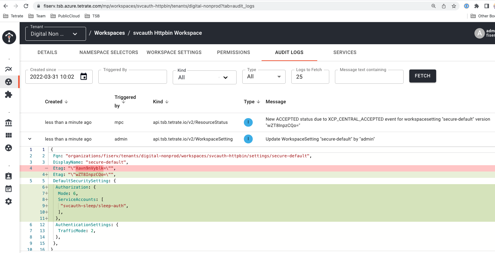

# Testing Service to Service AuthZ using httpbin and sleep
In this use case, we will install three applications in three separate namespaces to demonstrate service to service AuthZ.  We will also create distinct service accounts.

## First install the httpbin application 

```bash
kubectl create namespace svcauth-httpbin
kubectl label namespace svcauth-httpbin istio-injection=enabled --overwrite=true

```

```bash
kubectl apply -n svcauth-httpbin -f httpbin.yaml
```
Verify the httpbin app is running before continuing

```bash
kubectl get po -n svcauth-httpbin
```
You should see one pod running with 2 containers (app and sidecar)

## Next install the sleep application 

```bash
kubectl create namespace svcauth-sleep
kubectl label namespace svcauth-sleep istio-injection=enabled --overwrite=true

```

```bash
kubectl apply -n svcauth-sleep -f sleep.yaml
```
Verify the sleep app is running before continuing

```bash
kubectl get po -n svcauth-sleep
```
You should see one pod running with 2 containers (app and sidecar)

## Now, install the another sleep application in a non istio-injection namespace

```bash
kubectl create namespace svcauth-sleep-nonistio

```

```bash
kubectl apply -n svcauth-sleep-nonistio -f sleep.yaml
```
Verify the sleep app is running before continuing

```bash
kubectl get po -n svcauth-sleep-nonistio
```
You should see one pod running with one container

# TSB Configuration
For this use case, we will be testing connectivity inside the kubernetes cluster, so we will not need to create and configure an ingress and we will also not need to create TSB groups for this workspace.

## Create the httpbin TSB workspace

```bash
tctl apply -f svcauth-httpbin-workspace.yaml
```

## Let's do some connection testing
So far, we have configured ZERO security policy, meaning any pod running in our kubernetes clusters can access any service. We can test this out using a curl from a pod that is in a namespace that is not Istio-enabled, meaning that it will not be part of the service mesh.

Test with curl from the sleep pod to the httpbin pod:

```bash
export SLEEP_POD=$(kubectl get pod -n svcauth-sleep-nonistio -l app=sleep -o jsonpath={.items[].metadata.name})

echo "We will be testing from $SLEEP_POD"

```
We will use the sleep pod in the svcauth-sleep-nonistio namespace to curl the httpbin pod in the svcauth-httpbin namespace:

```bash
kubectl exec ${SLEEP_POD} -n svcauth-sleep-nonistio -c sleep --  \
  curl -v http://httpbin.svcauth-httpbin:8000/headers -s -L -w "\nStatus code:%{http_code}\n"

```
We were able to send a plain HTTP request to the service and our request was trusted simply because we are in the same kubernetes cluster. That is a bad thing! We will now add some security policy - starting at the Workspace level.

- We will add strict mTLS to services running in svcauth-httpbin workspace. In other words, we will add Authentication policy based on the service identity issued by the mesh.
- We will add authorization policy based on the service identities issued by the mesh.

## Configure Service to Service Authentication (strict mTLS)
Within TSB establishing default policy for AuthN/Z is a trivial task. We will create a default WorkspaceSetting that will apply to our workspace using tctl apply:

```bash
tctl apply -f default-workspace-settings.yaml

```
The important part of the `default-workspace-settings.yaml` file is this:
```
defaultSecuritySetting:
  authenticationSettings:
    trafficMode: REQUIRED
```

If you run the following, you will see the PeerAuthentication policy was applied to our namespace with a setting of `mode: STRICT`

```bash
kubectl get peerauthentications.security.istio.io -n svcauth-httpbin -o yaml

```
We can now test again:

```bash
kubectl exec ${SLEEP_POD} -n svcauth-sleep-nonistio -c sleep --  \
  curl -v http://httpbin.svcauth-httpbin:8000/headers -s -L -w "\nStatus code:%{http_code}\n"

```
We see the connection fails with a message like:
```
*   Trying 172.40.39.127:8000...
* Connected to httpbin.svcauth-httpbin (172.40.39.127) port 8000 (#0)
> GET /headers HTTP/1.1
> Host: httpbin.svcauth-httpbin:8000
> User-Agent: curl/7.82.0-DEV
> Accept: */*
>
* Recv failure: Connection reset by peer
* Closing connection 0
Status code:000
command terminated with exit code 56
```

Next, let's test from the svcauth-sleep pod that is part of the service mesh:

```bash
export SLEEP_POD_MESH=$(kubectl get pod -n svcauth-sleep -l app=sleep -o jsonpath={.items[].metadata.name})

echo "We will be testing from $SLEEP_POD_MESH"

```

```bash
kubectl exec ${SLEEP_POD_MESH} -n svcauth-sleep -c sleep --  \
  curl -v http://httpbin.svcauth-httpbin:8000/headers -s -L -w "\nStatus code:%{http_code}\n"

```
We see that our call succeeds!  Also, if you inspect the output from the httpbin/headers response, you can see the SPIFFE workload identity is passed from sleep to httpbin in the `X-Forwarded-Client-Cert` field.  

```
> GET /headers HTTP/1.1
> Host: httpbin.svcauth-httpbin:8000
> User-Agent: curl/7.82.0-DEV
> Accept: */*
>
{
  "headers": {
    "Accept": "*/*",
    "Content-Length": "0",
    "Host": "httpbin.svcauth-httpbin:8000",
    "User-Agent": "curl/7.82.0-DEV",
    "X-B3-Parentspanid": "636c515d46808f18",
    "X-B3-Sampled": "0",
    "X-B3-Spanid": "8c8d7a910f80926d",
    "X-B3-Traceid": "5905c8476080fd13636c515d46808f18",
    "X-Envoy-Attempt-Count": "1",
    "X-Forwarded-Client-Cert": "By=spiffe://cluster.local/ns/svcauth-httpbin/sa/httpbin;Hash=bd53a171b37c37b7944dd9ff52ea75c411ef56f0068409cefda814ec0ed95d17;Subject=\"\";URI=spiffe://cluster.local/ns/svcauth-sleep/sa/sleep"
  }
}
* Mark bundle as not supporting multiuse
< HTTP/1.1 200 OK
< server: envoy
< date: Wed, 30 Mar 2022 19:30:23 GMT
< content-type: application/json
< content-length: 585
< access-control-allow-origin: *
< access-control-allow-credentials: true
< x-envoy-upstream-service-time: 51
<
{ [585 bytes data]
* Connection #0 to host httpbin.svcauth-httpbin left intact

Status code:200
```
# Next we will add another application and the configuration to explicitly trust based on service account
```bash
kubectl apply -n svcauth-sleep -f sleep-auth.yaml
```
Verify the sleep app is running before continuing

```bash
kubectl get po -n svcauth-sleep
```
You should see one sleep-auth pod running with 2 containers (app and sidecar).  In addition, if we inspect the `sleep-auth.yaml` file, we will see the new service account specified:
```bash
apiVersion: v1
kind: ServiceAccount
metadata:
  name: sleep-auth
```

# Let's verify connectivity
```bash
export SLEEP_AUTH_POD_MESH=$(kubectl get pod -n svcauth-sleep -l app=sleep-auth -o jsonpath={.items[].metadata.name})

echo "We will be testing from $SLEEP_AUTH_POD_MESH"

```

```bash
kubectl exec ${SLEEP_AUTH_POD_MESH} -n svcauth-sleep -c sleep --  \
  curl -v http://httpbin.svcauth-httpbin:8000/headers -s -L -w "\nStatus code:%{http_code}\n"

```
This should succeed, and notice the SPIFFE workload identity for the new sleep-auth pod:
```
    "X-Forwarded-Client-Cert": "By=spiffe://cluster.local/ns/svcauth-httpbin/sa/httpbin;Hash=5f651217cc0163d8332b2cd8af0618caf0ff71793b7b974fafa9c2ef948a1682;Subject=\"\";URI=spiffe://cluster.local/ns/svcauth-sleep/sa/sleep-auth"
```

## Add the service account entry to restrict access
Lets apply the policy to restrict communication to httpbin by specifying the service account

```bash
tctl apply -f policy-authz-workspace-settings.yaml

```
We have made one minor update to the defaultSecuritySettings:
```bash
13a14,17
>     authorization:
>       mode: CUSTOM
>       serviceAccounts:
>         - svcauth-sleep/sleep-auth
```
This will restrict service to service authorization to only services that present the identity linked to the svcauth-sleep/sleep-auth service account. This is linked to the SPIFFE workload identity encoded in the x509 ceritifcate that is utilized by the sidecar proxy when making inter-mesh service calls. 

Note: In the TSB UI, you can navigate to the AUDIT LOGS tab for this workspace and see a "diff" of the change being recorded:
```bash
https://fiserv.tsb.azure.tetrate.com/mp/workspaces/svcauth-httpbin/tenants/digital-nonprod?tab=audit_logs
```



## Test from both instances of sleep (trusted and non-trusted)

Let's verify that our original sleep pod using the other service account is now blocked:

```bash
kubectl exec ${SLEEP_POD_MESH} -n svcauth-sleep -c sleep -- \
   curl -v http://httpbin.svcauth-httpbin:8000/headers -s -L -w "\nStatus code:%{http_code}\n"

```

We see this call fails with a 403 - it should look something like this:
```bash
*   Trying 172.40.39.127:8000...
* Connected to httpbin.svcauth-httpbin (172.40.39.127) port 8000 (#0)
> GET /headers HTTP/1.1
> Host: httpbin.svcauth-httpbin:8000
> User-Agent: curl/7.82.0-DEV
> Accept: */*
>
RBAC: access denied* Mark bundle as not supporting multiuse
< HTTP/1.1 403 Forbidden
< content-length: 19
< content-type: text/plain
< date: Thu, 31 Mar 2022 13:36:40 GMT
< server: envoy
< x-envoy-upstream-service-time: 0
<
{ [19 bytes data]
* Connection #0 to host httpbin.svcauth-httpbin left intact

Status code:403
```

Now, let's verify that our new sleep pod using the valid service account is authorized:

This call will use the sleep
```bash
kubectl exec ${SLEEP_AUTH_POD_MESH} -n svcauth-sleep -c sleep -- \
   curl -v http://httpbin.svcauth-httpbin:8000/headers -s -L -w "\nStatus code:%{http_code}\n"

```

Success!  And it should like something like this:

```bash
*   Trying 172.40.39.127:8000...
* Connected to httpbin.svcauth-httpbin (172.40.39.127) port 8000 (#0)
> GET /headers HTTP/1.1
> Host: httpbin.svcauth-httpbin:8000
> User-Agent: curl/7.82.0-DEV
> Accept: */*
>
* Mark bundle as not supporting multiuse
< HTTP/1.1 200 OK
< server: envoy
< date: Thu, 31 Mar 2022 13:40:39 GMT
< content-type: application/json
< content-length: 590
< access-control-allow-origin: *
< access-control-allow-credentials: true
< x-envoy-upstream-service-time: 2
<
{ [590 bytes data]
* Connection #0 to host httpbin.svcauth-httpbin left intact
{
  "headers": {
    "Accept": "*/*",
    "Content-Length": "0",
    "Host": "httpbin.svcauth-httpbin:8000",
    "User-Agent": "curl/7.82.0-DEV",
    "X-B3-Parentspanid": "4748d90d4085b438",
    "X-B3-Sampled": "0",
    "X-B3-Spanid": "12bc26a7edff8e5b",
    "X-B3-Traceid": "f7139e95062d09c84748d90d4085b438",
    "X-Envoy-Attempt-Count": "1",
    "X-Forwarded-Client-Cert": "By=spiffe://cluster.local/ns/svcauth-httpbin/sa/httpbin;Hash=c0b23ae42bbb41a187c4df73dcab2957c8fcf0738d0d6b534527782c18f762cd;Subject=\"\";URI=spiffe://cluster.local/ns/svcauth-sleep/sa/sleep-auth"
  }
}

Status code:200
```

# Cleaning Up

## Delete the TSB configurations

```bash
tctl delete -f svcauth-httpbin-workspace.yaml

```

## Delete the kubernetes objects by deleting the namespace

```bash
kubectl delete ns svcauth-sleep
kubectl delete ns svcauth-sleep-nonistio
kubectl delete ns svcauth-httpbin

```
